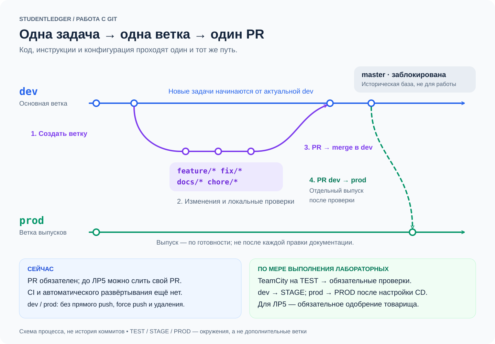

# StudentLedger

Учебная информационная система учёта успеваемости студентов.
Требования: актуальное ТЗ в `docs/reports/ЛР1, Первухин Роман, 241-3211.docx`
и одноимённый PDF. Перед работой читать `AGENTS.md` и context-файлы.

## Текущий этап: ЛР2

Реализован только технический прототип FastAPI: `GET /health` возвращает
HTTP 200 и `{"status":"ok"}`. Это проверка работы HTTP-процесса.
БД, UI, аутентификация и FR-01–FR-14 пока не реализованы; критерии полной
приёмки G-05 / SYS-01 / AC-02 этим прототипом не закрываются.

## Локальный запуск (Python 3.12)

Из корня проекта:

```bash
python3 -m venv .venv
.venv/bin/python -m pip install -r requirements.txt
.venv/bin/python -m uvicorn app.main:app --host 127.0.0.1 --port 8000
```

В другом терминале:

```bash
curl --fail-with-body -i http://127.0.0.1:8000/health
```

Остановка сервера: Ctrl+C. После установки запуск выполняется последней
командой `uvicorn`; воспроизводимый запуск всего продукта с PostgreSQL
одной командой относится к следующим этапам.

## Лабораторная работа № 2

- [Сверка источников](docs/SOURCE_REVIEW.md).
- [Пошаговая настройка TEST/STAGE/PROD](docs/LR2_RUNBOOK.md).
- [Подтверждения и шаблон фактических результатов](docs/evidence/lr02/README.md).
- [Состояние и следующий шаг](HANDOFF.md).

Не переходить к ЛР3 до завершения ручной части и отчёта ЛР2.

## План реализации

[PR веб-приложения APP-01–10](docs/LABS_PLAN.md#план-разработки-через-pr):
состав, зависимости и критерии готовности продуктовых изменений. Готовность
CI/CD и стендов указана как условие начала; инфраструктурные работы описаны
отдельно в разделах ЛР. Это будущие PR; принята схема временная ветка → dev → prod (ADR-009).
Текущая реализация и статус ЛР2 не изменились.

## Совместная работа

Проект выполняется командой из трёх человек. Текущий исполнитель берёт одну
согласованную задачу и передаёт результат через общий Git-репозиторий.
По умолчанию задачи выполняются последовательно. Перед началом договоритесь
в команде, что эту задачу сейчас не выполняет другой участник.
Имена исполнителей в инструкциях и отдельный реестр задач не нужны.

### Первый запуск на другом компьютере

1. Получите доступ к общему репозиторию и клонируйте его. URL и рабочую ветку
   возьмите из фактической передачи; не вставляйте токен в URL.
2. Откройте корень проекта в своём агенте и передайте стартовый запрос ниже.
3. Создайте собственное окружение по разделу «Локальный запуск».

История чата, запущенный сервер, `.venv`, аккаунты и разрешения инструментов
не переносятся через Git. Всё необходимое для продолжения должно быть в
файлах; секреты передаются отдельно через штатные средства доступа.

Для первоначальной публикации текущей папки используйте раздел 5
[инструкции ЛР2](docs/LR2_RUNBOOK.md). Общий remote и доступы троим
текущий исполнитель настраивает на выбранной площадке. Их наличие следует
подтвердить; одних локальных коммитов недостаточно для передачи.

### Чек-лист готовности Git и GitHub

Агент проверяет этот список перед первой публикацией на компьютере и после
ошибок доступа. Для каждого относящегося к задаче пункта указывает:
**готово / не настроено / не проверено / не требуется**. Чтение репозитория
не доказывает право записи; отсутствие upstream у новой ветки нормально.
Не создавать пробные коммиты/PR и не менять общие ветки ради проверки доступа.

| Что проверить | Как проверить | Что делать, если не готово |
|---|---|---|
| Git и репозиторий | `git --version`, `git rev-parse --show-toplevel` | Указать, нужен Git, clone или переход в правильную папку; не выполнять `git init` поверх неизвестного каталога |
| Автор коммита | `git var GIT_AUTHOR_IDENT`, `git var GIT_COMMITTER_IDENT`; при ошибке — `git config --show-origin --get user.name` и аналогично `user.email` | Получить настоящие имя/email пользователя; настроить `git config --local user.name "Имя"` и `git config --local user.email "Email"`. Не выдумывать личность и не менять глобальную конфигурацию без запроса |
| Рабочее дерево и ветка | `git status --short --branch`, `git branch --show-current` | Разобрать происхождение правок, detached HEAD и текущую задачу; сохранить работу без автоматического stash/reset |
| Remote | `git remote get-url origin` | Сверить с адресом проекта; если отсутствует — добавить подтверждённый URL. Если URL содержит credentials, не выводить их в чат/логи и не сохранять в документах |
| Доступ на чтение и база | `git ls-remote --heads origin dev`, затем разрешённый `git fetch origin` | Различить ошибку сети, аутентификации, доступа и отсутствие dev. Не считать старую локальную dev актуальной |
| GitHub CLI, если публикация PR идёт через него | `gh --version`, `gh auth status --hostname github.com` | Установить CLI или выполнить `gh auth login --hostname github.com`; для нового PAT обновить используемый способ авторизации. Токен не передавать в чат или аргумент команды |
| Аккаунт и доступ к репозиторию | `gh api user --jq .login`, `gh repo view PervuhinRoman/SLCA --json nameWithOwner,viewerPermission` | Проверить аккаунт, приглашение в collaborators и право write. Git credential helper/SSH и gh могут использовать разные аккаунты — проверять оба канала |
| Права fine-grained PAT, если используется PAT | В настройках токена проверить выбранный SLCA и repository permissions | Для HTTPS push — **Contents: Read and write**, для PR — **Pull requests: Read and write**. Для изменения default/защит — **Administration: Read and write**, только если такая настройка запрошена. Право admin аккаунта не заменяет разрешения токена |
| Upstream и адрес публикации | `git branch -vv`, при необходимости `git config --get push.default` | Для новой временной ветки задать upstream командой `git push -u origin <ветка>`; не использовать `--all`, `--mirror` и не отправлять изменения в dev/prod/master напрямую |
| Защита и состояние PR | Проверить base/head и статус PR на GitHub; при CLI — `gh pr view` и доступные сведения о защите | Соблюдать действующие ограничения; отсутствие CI назвать явно. Для проверки статусов административные права не требовать автоматически |

Если настройка отсутствует, ответ должен быть конкретным: **операция →
наблюдаемая ошибка → недостающая настройка или гипотеза → точный шаг
исправления → повторная проверка**. Например: «Push успешен, создание PR
вернуло 403; проверьте Pull requests: Read and write для SLCA у токена gh».
HTTP 403 сам по себе не доказывает единственную причину: проверить выбранный
репозиторий, аккаунт, разрешения токена и ограничения организации, если она есть.

Не печатать токены, `gh auth token`, полный credential store или весь вывод
`git config --list`. Если gh получает токен из GH_TOKEN/GITHUB_TOKEN,
проверить источник без вывода значения: повторный login может не заменить
токен окружения. Для SSH проверить соответствующий ключ/аккаунт; разрешение
Contents у PAT не относится к SSH push.

### Если пользователь попросил «сделай и запушь»

Это разрешение выполнить **весь цикл задачи**: изменения → проверки →
обновление контекста → commit → push рабочей ветки → PR в `dev` по правилам
проекта. Не останавливаться на локальном результате или инструкции пользователю
«теперь сделайте push», если агент может выполнить разрешённые действия сам.
Не запрашивать повторное подтверждение commit/push/PR в пределах этой задачи.
Если пользователь явно ограничил запрос (например, «без PR»), соблюдать его.
Обязательное разрешение среды исполнения запрашивается штатным инструментом;
отказ не обходится другим способом.

1. Проверить готовность по списку выше и определить состав задачи. Для новой
   задачи использовать временную ветку от актуальной `origin/dev`; для
   продолжающейся — подходящую существующую ветку и открытый PR. Не добавлять
   новые задачи в уже слитую ветку. Существующие локальные правки не терять.
2. Выполнить задачу целиком, проверить результат, обновить HANDOFF и затронутые
   документы. Перед commit просмотреть diff, явно выбрать файлы и проверить
   staged diff. Не включать чужие изменения, секреты и локальные окружения.
3. Создать содержательный commit и выполнить push именно своей ветки;
   для новой ветки настроить upstream. Не делать force push для обхода
   non-fast-forward: сначала выяснить расхождение, сохранив обе стороны.
4. Проверить успешный результат push и совпадение SHA опубликованной ветки
   с локальным HEAD, например через `git ls-remote --heads origin <ветка>`.
   Создать PR в `dev` или обновить существующий; проверить его base/head и URL.
   Не создавать дубликат PR. Push **не разрешает автоматически merge, выпуск
   в prod или deploy**; они требуют соответствующего запроса пользователя.
5. В финале сообщить ветку, SHA, проверки, результат push, ссылку PR и
   оставшиеся ограничения. Если push прошёл, а PR не создан, так и написать;
   не объявлять весь цикл завершённым. Проверка прав на чтение или dry-run
   не заменяет фактический успешный push.

При блокере закончить независимую доступную работу и назвать конкретный
неудавшийся шаг. После сообщения пользователя «исправил/готово» повторить
нужный шаг и довести ранее разрешённую публикацию до результата, не требуя
заново разрешения на ту же задачу. Это правило не означает, что агент должен
самостоятельно ослаблять защиту веток или запрашивать лишние права токена.

### Начало очередной задачи

В корне уже клонированного проекта:

```bash
git status --short
git branch --show-current
git remote -v
```

Если есть несохранённая работа, сначала согласуйте и сохраните её.
На чистой рабочей ветке с настроенным upstream получите изменения:

```bash
git pull --ff-only
```

Если Git сообщает о расхождении истории, разберите различия вместе с агентом;
не используйте force push или reset для обхода ошибки.
Перечитайте `HANDOFF.md`: текущий этап, что уже проверено, что осталось.

Стартовый запрос агенту (уточните задачу при необходимости):

> Прочитай AGENTS.md и все указанные в нём файлы. Проверь состояние Git
> и соответствие текущей задачи ТЗ и плану лабораторных. Продолжи следующий
> незавершённый шаг из HANDOFF.md в пределах текущего этапа. Выполни доступную
> работу, проверь результат и обнови контекст. Для действий, требующих моего
> участия, дай точные инструкции и список подтверждений. Подготовь результат
> к передаче; не считай невыполненные проверки успешными.

### Завершение и передача

1. Выполните проверки задачи. Сохраните реальные результаты в evidence,
   укажите также невыполненные проверки и причины.
2. Обновите `HANDOFF.md` и затронутые context-файлы, даже если задача ещё
   не завершена. Должен быть понятен следующий конкретный шаг.
3. Проверьте diff, добавьте только относящиеся к задаче файлы и отправьте
   код вместе с контекстом. В командах замените заполнители реальными значениями:

```bash
git diff --check
git diff
git add <файлы-задачи>
git diff --cached
git commit -m "<краткий результат задачи>"
git push
git rev-parse HEAD
git status --short
```

Для новой ветки без upstream: `git push -u origin <ветка>`.
Commit и push можно поручить агенту явно. Если работа частичная, обозначьте
это в handoff и сообщении коммита. Успешный локальный commit при неудачном
push ещё не передаёт работу остальным.

Передайте команде ветку, SHA (и ссылку на PR, если он есть), результат push
и следующий шаг. SHA текущего коммита сообщается после commit; не нужно
создавать новый коммит только ради записи собственного SHA в handoff.

### Ветки и PR для любых изменений

**Коротко:** начните от актуальной `dev`, создайте ветку под одну задачу,
отправляйте коммиты в неё и откройте PR обратно в `dev`. После слияния
начинайте следующую задачу от обновлённой `dev`. Это одинаково работает
для функций, исправлений, инструкций и конфигурации.

`prod` обновляется отдельным PR из `dev` при выпуске проверенной версии.
Рабочие ветки не сливаются прямо в `prod`. `master` сохранена как
заблокированная историческая база; новые задачи начинаются от `dev`.

**Текущий режим:** PR обязателен, но до ЛР5 автор может сам выполнить merge
без чужого одобрения (ADR-014). Сначала проверьте diff и результат локальных
проверок, закройте обсуждения. CI и автоматического deploy пока нет.
Перед ЛР5 станет обязательным одобрение другого участника; после настройки
TeamCity — успешные CI-проверки. TEST — среда проверок, STAGE — среда
проверки интегрированной версии из `dev`, PROD — среда выпуска из `prod`.



[Открыть PNG-версию схемы](docs/assets/branch-workflow.png).

Принято 2026-10-10 (ADR-009, SW-09; временное исключение ADR-014):

| Ветка | Назначение | Откуда и куда |
|---|---|---|
| `dev` | Интеграция изменений; после успешного CI — публикация образа и STAGE | PR из временных веток |
| `prod` | Проверенная на STAGE версия; выпуск на PROD | PR из `dev` |
| `feature/<задача>` | Новая функция приложения | От `dev`, PR в `dev` |
| `fix/<задача>` | Исправление дефекта | От `dev`, PR в `dev` |
| `docs/<задача>` | Инструкции, ТЗ, отчёты, context-файлы | От `dev`, PR в `dev` |
| `chore/<задача>` | CI/CD, конфигурация, зависимости и обслуживание | От `dev`, PR в `dev` |

TEST — среда сборки и проверок, отдельная постоянная ветка `test` не нужна.
`master` сохраняет историческую роль начальной публикации; после перехода
новые задачи от неё не ответвляются. `main`, `develop`, `release/*` новой
схемой не используются. Основная ветка — dev; dev/prod защищены, master
заблокирована. PR #1 с ЛР1 уже слит. CI отсутствует. До ЛР5 действует
временное разрешение merge без чужого approval (ADR-014).

Изменение инструкции — тоже полноценная задача с веткой и PR, хотя по смыслу
это документация, а не новая функция. Если документация описывает изменяемый
код, включайте её в тот же feature/fix PR. Не отделяйте обязательные
HANDOFF/REQUIREMENTS_MAP от реализации. Один PR — одна связная задача;
несвязанные изменения не объединять только ради удобства.

### Выполнение задачи

1. Согласовать, что задача свободна, и прочитать контекст. Проверить рабочее
   дерево; при чужих/несохранённых изменениях сначала согласовать их статус.
2. На чистом дереве получить актуальную `dev` и создать временную ветку.
   Пример для следующей функции приложения:

```bash
git fetch origin
git switch dev
git pull --ff-only origin dev
git switch -c feature/edit-student
```

   Если локальной dev ещё нет, но `origin/dev` существует, вместо `git switch dev`
   выполнить `git switch --track origin/dev`. Для инструкций использовать,
   например, `docs/update-runbook`. Не выполнять эти команды поверх текущих
   незакоммиченных изменений и не сбрасывать историю при ошибке.

3. Реализовать задачу, добавить необходимые тесты, обновить контекст и
   инструкции. Изменения схемы — через Alembic с backup существующей БД.
4. Проверить diff и локальные проверки, создать коммит и отправить свою ветку.
   Пути для `git add` выбирать явно по diff; секреты и локальные окружения
   не включать. Пример после подготовки согласованного коммита:

```bash
git push -u origin feature/edit-student
```

5. Открыть PR в `dev`. В описании: проблема и результат, требования FR/SEC
   (или пункт документа/ЛР), проверки и их ограничения, миграции/ручные шаги,
   evidence и скриншоты UI при изменении интерфейса. Для изменения ТЗ указать
   решение человека и согласованную новую формулировку.
6. В целевом процессе дождаться CI на последнем SHA и review **другого участника**.
   Сейчас CI отсутствует, а до ЛР5 разрешён самостоятельный merge после
   локальных проверок (ADR-014). Это исключение из SW-09, не выполнение ЛР5. Исправления
   отправлять в ту же ветку; после новых коммитов снова проверить CI и
   актуальность review. Не сливать известный плохой код для демонстрации:
   отрицательный прогон проводится в рабочей ветке, затем дефект исправляется.
7. Влить PR в `dev`. После появления CI/CD проверить сборку объединённого
   кода и реальное развёртывание на STAGE. После merge ветку можно удалить; следующую задачу
   начинать от обновлённой dev. Ошибка deploy остаётся незакрытым результатом.

### Проверки, документация и выпуск

- Прямые push в `dev`/`prod`, force push и обход review не являются рабочим
  процессом. Первичное создание веток выполняется отдельно по проверенному
  SHA, без переписывания истории. На GitHub настроена защита обеих
  веток: PR; сейчас число обязательных одобрений равно 0 (ADR-014).
  Перед ЛР5 включить минимум одно одобрение, после появления CI — его статус.
- После настройки TeamCity собирает все ветки и запускает анализаторы/тесты;
  после ЛР7 unit/integration-тесты обязательны независимо от типа ветки.
  После ЛР8 проверка SQL также выполняется во всех ветках. Docs-only PR
  не получает автоматического освобождения от этих требований.
- Для docs PR дополнительно проверить факты, команды, ссылки, Markdown;
  DOCX/PDF — синхронность и рендер. Это не замена общим CI-проверкам.
- Пока CI ещё не создан, использовать локальные проверки и review с явным
  указанием отсутствия CI. После включения обязательных проверок не обходить
  их из-за того, что изменились «только инструкции».
- Публикация образов выполняется для dev/prod, deploy — в соответствующее
  окружение. Feature/fix/docs/chore ветки сами не обновляют общие STAGE/PROD.
  Для простоты учебного процесса docs-merge в dev проходит обычный pipeline
  STAGE; отдельный немедленный выпуск на PROD для каждой правки не нужен.
- Выпуск: выбрать успешно проверенный на STAGE SHA из dev и открыть PR
  `dev → prod`. Если dev изменился, повторно проверить фактического кандидата
  на STAGE. В prod проверяется и развёртывается именно одобренная версия;
  до миграции — backup, при ошибке проверок/backup/миграции deploy останавливается.
- Для регулярных feature PR допускается squash merge, но PR `dev → prod`
  выполнять merge-коммитом с сохранением общей истории веток, без squash
  и самостоятельных изменений в prod. Исправления также идут через dev/STAGE.
- Защита GitHub и передача статусов TeamCity требуют фактической настройки
  и отрицательной проверки запрета merge. Если настройки недоступны,
  зафиксировать ограничение: договорённость команды не является автоматической
  блокировкой. Не заявлять настройку выполненной без проверки.

### Первоначальный переход и текущие ограничения

2026-10-10 созданы и опубликованы dev и prod от проверенной master
`816ac3eca4fcf73d2de12a65b907916a97fcaeee`. История master сохранена.
Обновление ЛР1/правил опубликовано через docs/lr1-branch-workflow и PR #1 в dev.
APP-01–03 сейчас не выполняются; CI ещё нет. Документационный PR подтвердил
ветки, commit, push и merge; чужого review и успешного CI/deploy не было.

После обновления разрешений токена настройки применены и проверены через API:

- Settings → General → Default branch: dev.
- Settings → Branches: для dev/prod Require a pull request before merging;
  число обязательных approvals — 0, автор может сам выполнить merge.
- Require conversation resolution включено; Dismiss stale approvals включено.
- Правила применяются к администраторам (Do not allow bypassing).
- Force pushes и удаления запрещены; linear history и code owner review
  не требуются. Require approval of most recent push выключено.
- Required status checks пока отсутствуют, поскольку CI ещё не создан.
- Для master включён Lock branch, запрет force push и удаления.

Это подтверждённое пользователем временное отступление от SW-09 и ЛР5,
п. 5, стр. 22. Перед ЛР5 включить минимум одно одобрение для dev/prod и
получить review другого участника. После появления TeamCity добавить
фактический required check и Require branches to be up to date.

[PR #1](https://github.com/PervuhinRoman/SLCA/pull/1) уже слит пользователем
PervuhinRoman в dev; CI и reviews отсутствуют. Агент merge не выполнял.
Защита проверена чтением API, попытки запрещённого push/delete не проводились.
Для отчёта сохранить скриншоты правил; будущий запрет merge при failed CI
проверить после настройки TeamCity. Выпуск на PROD в этом этапе не выполняется.

Репозиторий: [PervuhinRoman/SLCA](https://github.com/PervuhinRoman/SLCA).
До перехода для воспроизведения ЛР2 используйте зафиксированную версию из
LR2_RUNBOOK; новые рабочие копии для разработки клонируют dev:

```bash
git clone --branch dev https://github.com/PervuhinRoman/SLCA.git StudentLedger
```
